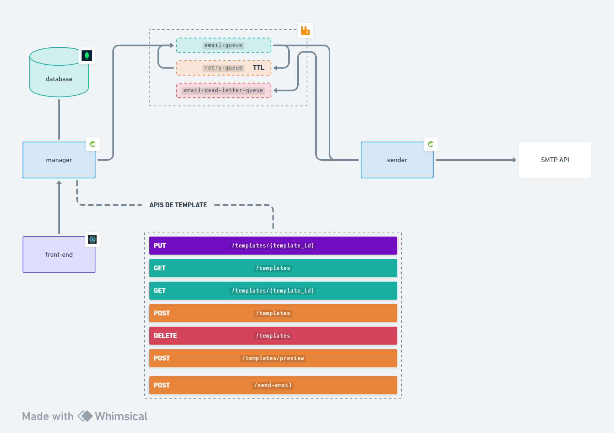

## Email template manager



## first steps
- create `.env` file and add permission on startup script
  ```shell
  chmod -R +x .docker/scripts && .docker/scripts/setup
  ```
- creating node_modules
  ```shell
  docker run --rm --name app -v $(pwd)/manager-app:/app -w /app node:16.14.2 npm install
  ```
- starting containers
  ```shell
  .docker/scripts/develop up -d --build
  ```